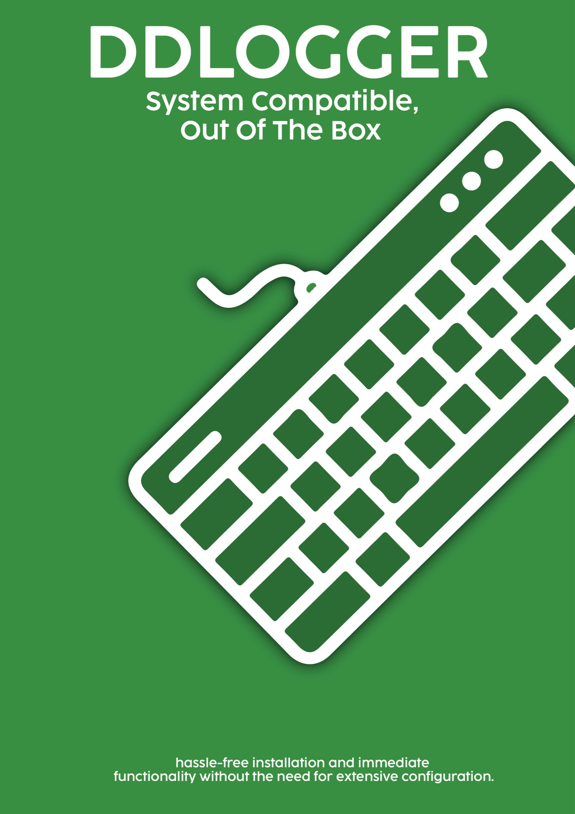

# ddlogger

keylogger/decoder

## Report

The focus of my Something Awesome Project is systems-level security.

Because I use Linux as my daily driver, I have lots of fun challenges to make simple things happen.

[Watch the AirPods video](https://raw.githubusercontent.com/flinnthebin/ddlogger/main/airpods.mp4)

